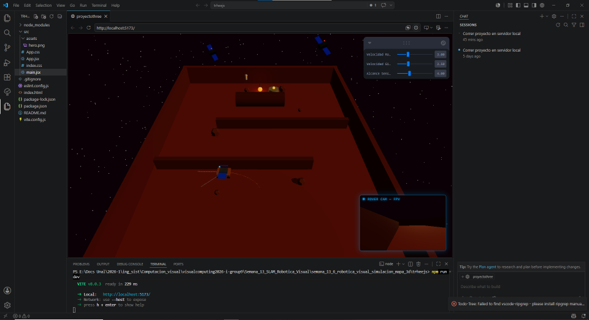
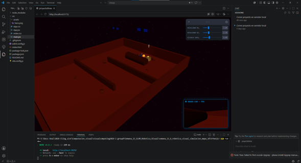
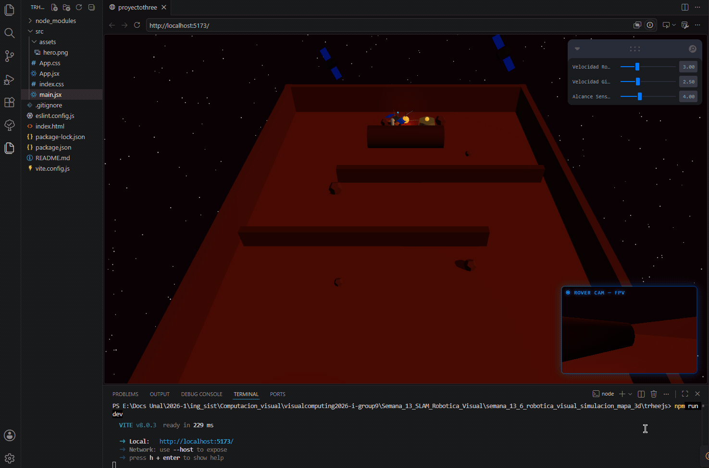

# Examen Final — Computación Visual 2026-I

## Nombre del estudiante

Juan Camilo López Bustos

## Fecha de entrega

`2026-06-14`

---

## Descripción breve

Este repositorio contiene la entrega práctica del examen final del curso de Computación Visual (2026-I) de la Universidad Nacional de Colombia. El objetivo central fue integrar los principales temas del curso —procesamiento de imágenes, visión por computador, gráficos 3D, materiales, animación e interacción— en dos ejercicios independientes pero complementarios.

El **Ejercicio 1** aborda el procesamiento visual clásico mediante un pipeline implementado en Python con OpenCV: se parte de una imagen cargada por el usuario y se le aplican, en secuencia, conversión a escala de grises, representación HSV, suavizado gaussiano, detección de bordes con Canny y segmentación automática por color. El **Ejercicio 2** construye una escena 3D interactiva de exploración marciana usando React Three Fiber, en la que un rover autónomo navega un laberinto de Marte guiado por sensores de raycast, acompañado por un astronauta en órbita, dos satélites giratorios y un HUD con vista en primera persona.

Ambos ejercicios fueron desarrollados de forma individual, con código fuente reproducible, evidencias visuales y documentación detallada de las decisiones técnicas tomadas.

---

## Dependencias

| Ejercicio | Herramienta / Librería | Versión mínima |
|---|---|---|
| 1 | Python | 3.10+ |
| 1 | OpenCV (`opencv-python-headless`) | 4.9+ |
| 1 | NumPy | 1.24+ |
| 1 | Matplotlib | 3.7+ |
| 1 | Ultralytics (opcional, YOLO) | 8.0+ |
| 2 | Node.js | 18+ |
| 2 | React | 19.x |
| 2 | @react-three/fiber | incluido en drei |
| 2 | @react-three/drei | 10.7+ |
| 2 | Leva | 0.10+ |
| 2 | Vite | 8.0+ |

---

## Instalación y ejecución

### Ejercicio 1 — Python

```bash
# Opción A: Google Colab (recomendada — el notebook ya contiene !pip install)
# Abrir src/main.ipynb en https://colab.research.google.com y ejecutar celdas en orden.

# Opción B: entorno local
pip install opencv-python matplotlib numpy ultralytics
python ejercicio_1_procesamiento_visual/src/main.py
```

### Ejercicio 2 — React Three Fiber

```bash
cd ejercicio_2_escena_3d_interactiva/trheejs
npm install
npm run dev
# Abrir http://localhost:5173 en el navegador
```

---

## Estructura del repositorio

```
examen-final-computacion-visual-Juan-Camilo-Lopez-Bustos/
├── README.md                               ← este archivo
├── ejercicio_1_procesamiento_visual/
│   ├── src/
│   │   ├── main.py                         ← script Python ejecutable
│   │   └── main.ipynb                      ← notebook Colab con salidas
│   ├── resultados/
│   │   ├── original.png
│   │   ├── grises.png
│   │   ├── hsv.png
│   │   ├── suavizado.png
│   │   ├── bordes.png
│   │   ├── segmentacion.png
│   │   ├── mascara.png
│   │   ├── pipeline_completo.png
│   │   └── *_preview.png                   ← versiones con ejes y título
│   └── README.md
└── ejercicio_2_escena_3d_interactiva/
    ├── trheejs/                             ← proyecto Vite + React
    │   ├── src/
    │   │   └── App.jsx                     ← componente principal (escena completa)
    │   ├── package.json
    │   └── vite.config.js
    ├── media/
    │   ├── captura_1.png
    │   ├── captura_2.png
    │   └── demo.gif
    └── README.md
```

---

## Evidencias

### Ejercicio 1 — Pipeline de procesamiento visual


Panel con las 7 etapas del pipeline: original → grises → canal H (matiz) → suavizado gaussiano → bordes Canny → máscara de segmentación → detección final con bounding boxes.

### Ejercicio 2 — Escena 3D Marciana



Vista orbital de la escena: rover autónomo en el laberinto marciano con astronauta en órbita y satélites.



HUD de vista en primera persona (FPV) superpuesto sobre el canvas principal.



GIF demostrativo: navegación autónoma del rover, evasión de muros, órbita del astronauta e interacción con los controles Leva.

---

## Análisis técnico general

El Ejercicio 1 demuestra la aplicabilidad del pipeline clásico de visión por computador: cada etapa de transformación justifica la siguiente. La elección de HSV sobre LAB facilitó la segmentación por color en el paso final, y la separación entre suavizado previo a Canny y suavizado de la etapa 3 permite conservar independencia entre ambos resultados para la comparación visual.

El Ejercicio 2 integra múltiples patrones de programación 3D reactiva: uso de `useFrame` para animaciones continuas, `useRef` para mutación de estado sin re-renders, `Raycaster` para colisión y detección de obstáculos, y una arquitectura de doble canvas para el HUD FPV. La máquina de estados del rover (avance libre → evasión → anti-stuck → wall-following) es el núcleo algorítmico más complejo del proyecto.

---

## Uso de IA

Se utilizaron herramientas de IA generativa como apoyo en los siguientes aspectos:

- Generación de la estructura base del pipeline de OpenCV y revisión de parámetros del filtro Canny.
- Sugerencias para la arquitectura del componente `MarsRover` y la lógica de detección de obstáculos con Raycaster.
- Corrección de errores en la exportación de la matrix world de la cámara FPV hacia el canvas HUD.

Todo el código generado fue revisado, ajustado y verificado manualmente por el estudiante antes de su inclusión en el repositorio.

---

## Entrega

- Taller realizado de forma individual.
- Repositorio público: `examen-final-computacion-visual-Juan-Camilo-Lopez-Bustos`
