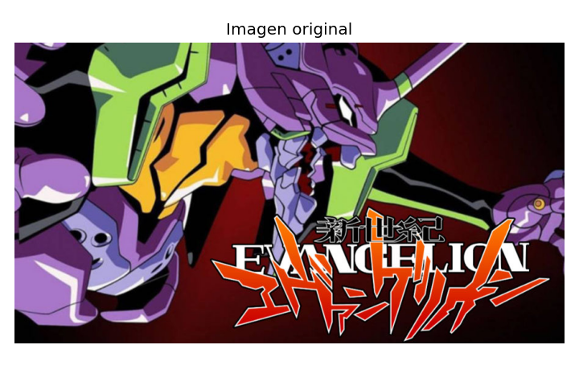
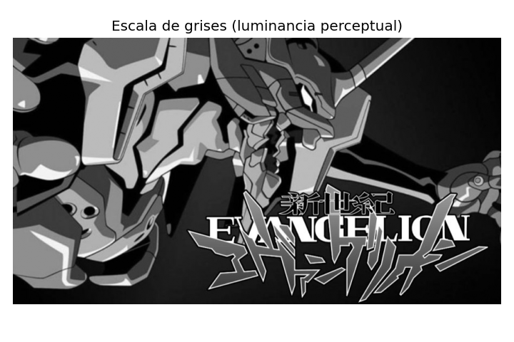
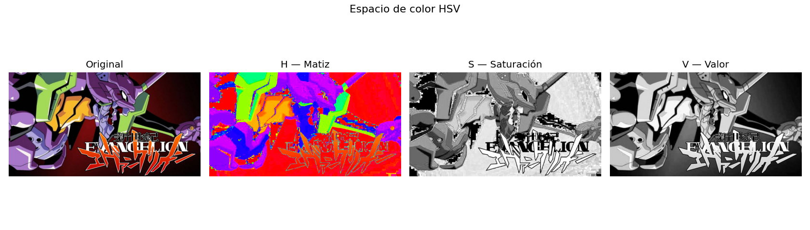
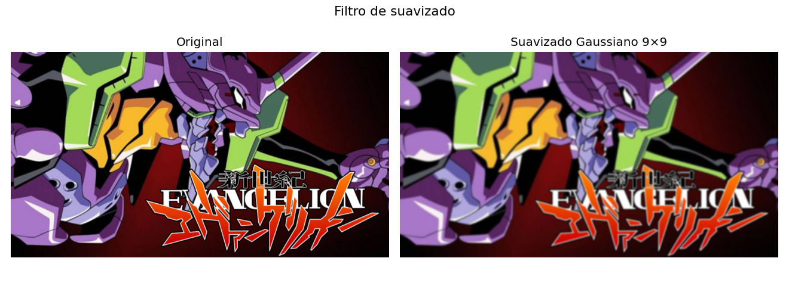
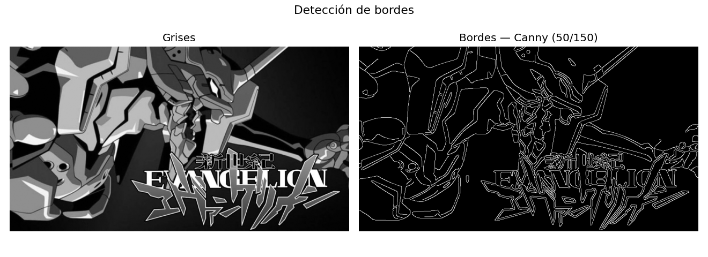
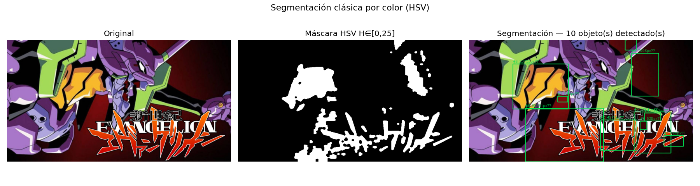
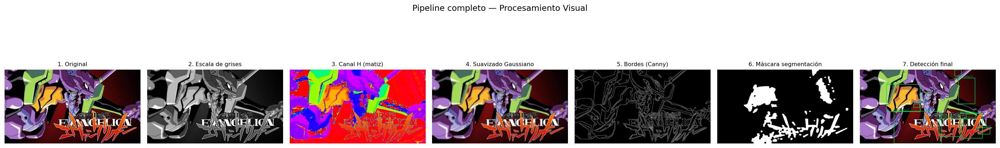

# Ejercicio 1 — Procesamiento Visual e IA

## Nombre del estudiante

Juan Camilo López Bustos

## Fecha de entrega

`2026-06-14`

---

## Descripción breve

Este ejercicio implementa un pipeline completo de procesamiento de imágenes en Python utilizando OpenCV. El objetivo es tomar cualquier imagen proporcionada por el usuario y aplicarle una secuencia ordenada de operaciones de visión por computador —transformaciones de color, filtrado, detección de bordes y segmentación— guardando los resultados intermedios para poder comparar cada etapa visualmente.

El pipeline fue diseñado para ser modular y reproducible: cada paso produce un archivo PNG independiente en la carpeta `resultados/`, además de una versión con título y ejes (`_preview.png`) útil para análisis. Al final se genera un panel comparativo con las 7 etapas en una sola imagen (`pipeline_completo.png`), lo que permite evaluar de un vistazo el efecto acumulado de cada transformación.

La implementación está disponible tanto como script Python (`main.py`) como notebook de Google Colab (`main.ipynb`), que incluye las salidas generadas para una imagen de ejemplo.

---

## Implementaciones

### Python

Pipeline implementado íntegramente con **OpenCV 4.x**, **NumPy** y **Matplotlib**. El flujo de trabajo sigue 6 pasos principales:

1. Carga de imagen vía `cv2.imdecode` (compatible con Colab y entorno local).
2. Conversión a escala de grises con la fórmula ponderada perceptual de OpenCV (`COLOR_BGR2GRAY`).
3. Conversión al espacio HSV (`COLOR_BGR2HSV`) y visualización de sus tres canales por separado.
4. Suavizado gaussiano con kernel 9×9 (`cv2.GaussianBlur`).
5. Detección de bordes con el algoritmo de Canny (umbrales 50/150).
6. Segmentación clásica por rango de color en HSV: detección automática del matiz dominante, máscara binaria con `cv2.inRange`, limpieza morfológica y extracción de contornos con bounding boxes.

Herramientas utilizadas: `opencv-python-headless`, `numpy`, `matplotlib`, `google.colab.files` (para la versión Colab).

---

## Resultados visuales

### Imagen original



Imagen de entrada cargada por el usuario. Se guarda como `original.png` y sirve como referencia base para todas las etapas posteriores.

### Escala de grises



Representación de luminancia perceptual usando la fórmula `Y = 0.299·R + 0.587·G + 0.114·B`. Se aprecia la distribución de brillo de la escena sin información de color.

### Espacio de color HSV



Los tres canales del espacio HSV mostrados por separado: matiz (H), saturación (S) y valor (V). El canal H (visualizado con colormap `hsv`) revela la distribución de tonos de color puros en la imagen, independientemente de la iluminación.

### Suavizado gaussiano



Filtro gaussiano con kernel 9×9 aplicado sobre la imagen original. Se observa la reducción del ruido de alta frecuencia y la suavización de texturas, preparando la imagen para la detección de bordes.

### Detección de bordes (Canny)



Bordes detectados con el algoritmo de Canny (umbrales 50 y 150). Los bordes resultantes son delgados y continuos, marcando con precisión las transiciones de intensidad más significativas de la escena.

### Segmentación por color



Segmentación automática basada en el matiz dominante detectado en el histograma del canal H. Los objetos del color predominante son delimitados con bounding boxes verdes, mostrando también el número de objeto y su área en píxeles.

### Panel comparativo completo



Las 7 etapas del pipeline en una sola imagen: original → grises → canal H → suavizado → bordes → máscara binaria → detección final. Permite comparar de un vistazo el efecto de cada transformación.

---

## Código relevante

### Carga y conversión de imagen

```python
import cv2
import numpy as np

# Decodificar imagen cargada por el usuario
img_array = np.frombuffer(uploaded[filename], dtype=np.uint8)
img_bgr = cv2.imdecode(img_array, cv2.IMREAD_COLOR)

# Escala de grises (luminancia perceptual: Y = 0.299·R + 0.587·G + 0.114·B)
gray = cv2.cvtColor(img_bgr, cv2.COLOR_BGR2GRAY)

# Espacio HSV: separa matiz de la intensidad lumínica
hsv = cv2.cvtColor(img_bgr, cv2.COLOR_BGR2HSV)
```

### Suavizado y detección de bordes

```python
# Filtro Gaussiano 9×9 — suavizado moderado sin destruir bordes importantes
blurred = cv2.GaussianBlur(img_bgr, (9, 9), sigmaX=0)

# Canny con relación de umbrales 1:3 (recomendada en el paper original)
gray_blurred = cv2.GaussianBlur(gray, (9, 9), 0)
edges = cv2.Canny(gray_blurred, threshold1=50, threshold2=150)
```

### Segmentación clásica por rango HSV

```python
# Detectar matiz dominante en el histograma del canal H
h_channel = hsv[:, :, 0]
hist_h = cv2.calcHist([h_channel], [0], None, [180], [0, 180])
dominant_h = int(np.argmax(hist_h))

# Máscara de color en rango ±25 alrededor del matiz dominante
lower = np.array([max(0, dominant_h - 25), 40, 40])
upper = np.array([min(179, dominant_h + 25), 255, 255])
mask = cv2.inRange(hsv, lower, upper)

# Limpieza morfológica: apertura elimina ruido, cierre rellena huecos
kernel_morph = cv2.getStructuringElement(cv2.MORPH_ELLIPSE, (5, 5))
mask = cv2.morphologyEx(mask, cv2.MORPH_OPEN,  kernel_morph, iterations=2)
mask = cv2.morphologyEx(mask, cv2.MORPH_CLOSE, kernel_morph, iterations=2)

# Extraer contornos y dibujar bounding boxes para objetos > 500 px²
contours, _ = cv2.findContours(mask, cv2.RETR_EXTERNAL, cv2.CHAIN_APPROX_SIMPLE)
for cnt in contours:
    if cv2.contourArea(cnt) < 500:
        continue
    x, y, w, h = cv2.boundingRect(cnt)
    cv2.rectangle(result, (x, y), (x+w, y+h), (0, 220, 80), 2)
```

---

## Prompts utilizados

```
"Explícame la diferencia entre el espacio de color HSV y LAB para segmentación de objetos"

"¿Cuál es la relación de umbrales recomendada para el algoritmo de Canny?"

"Cómo detectar el color dominante de una imagen usando el histograma del canal H en OpenCV"

"Genera un panel comparativo con matplotlib que muestre varias imágenes en una sola figura"
```

---

## Aprendizajes y dificultades

### Aprendizajes

El desarrollo de este ejercicio reforzó la comprensión del pipeline clásico de visión por computador como una cadena de decisiones técnicas interdependientes, no como una secuencia de pasos arbitraria. La elección de HSV sobre LAB para la segmentación quedó más clara al verificar experimentalmente que el canal H se mantiene estable ante cambios de iluminación, mientras que en RGB los mismos colores producen rangos muy distintos dependiendo del brillo. También quedó más claro por qué Canny aplica internamente un suavizado Gaussiano propio: esto permite entender que el suavizado previo en el paso 3 y el de Canny en el paso 4 tienen propósitos distintos y no son redundantes.

### Dificultades

La mayor dificultad fue lograr que la segmentación por color fuera robusta para imágenes con paletas de color variadas. El enfoque inicial con rangos fijos fallaba en imágenes con predominancia de tonos neutros. La solución fue automatizar la detección del matiz dominante mediante el histograma del canal H y centrar el rango de segmentación en ese valor, lo que hizo el pipeline agnóstico respecto al contenido visual específico de la imagen. Ajustar el área mínima de contorno (500 px²) también requirió varias iteraciones para evitar tanto ruido residual como pérdida de objetos pequeños.

### Mejoras futuras

En una siguiente versión sería valioso incorporar una etapa de detección con un modelo preentrenado (YOLOv8, ya incluido como dependencia) para complementar la segmentación clásica y comparar ambos enfoques cuantitativamente. También podría añadirse soporte para procesar video cuadro a cuadro, mostrando en tiempo real cómo evolucionan los bordes y la segmentación en una escena dinámica.

---

## Estructura del proyecto

```
ejercicio_1_procesamiento_visual/
├── src/
│   ├── main.py          # Script Python ejecutable en entorno local
│   └── main.ipynb       # Notebook Colab con salidas incluidas
├── resultados/
│   ├── original.png
│   ├── original_preview.png
│   ├── grises.png
│   ├── grises_preview.png
│   ├── hsv.png
│   ├── hsv_preview.png
│   ├── suavizado.png
│   ├── suavizado_preview.png
│   ├── bordes.png
│   ├── bordes_preview.png
│   ├── segmentacion.png
│   ├── segmentacion_preview.png
│   ├── mascara.png
│   ├── pipeline_completo.png
│   └── resultados_ejercicio1.zip
└── README.md
```

---

## Referencias

- Documentación oficial de OpenCV: https://docs.opencv.org/
- Canny, J. (1986). "A Computational Approach to Edge Detection". *IEEE Transactions on Pattern Analysis and Machine Intelligence*, 8(6), 679–698.
- OpenCV — Color Space Conversions: https://docs.opencv.org/4.x/de/d25/imgproc_color_conversions.html
- OpenCV — Morphological Transformations: https://docs.opencv.org/4.x/d9/d61/tutorial_py_morphological_ops.html

---

## Checklist de entrega

- [x] Carpeta `ejercicio_1_procesamiento_visual/`
- [x] Código limpio y funcional en `src/`
- [x] Resultados en `resultados/` con nombres descriptivos
- [x] README completo con todas las secciones requeridas
- [x] Más de 2 capturas/imágenes por implementación
- [x] Parámetros y decisiones técnicas documentadas
- [x] Notebook con salidas incluidas (Colab)
