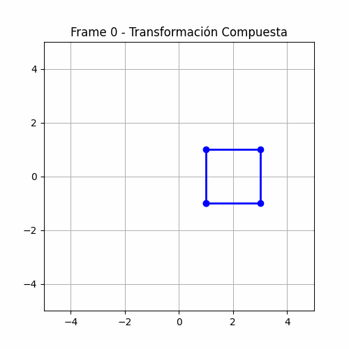

# Taller  - Transformaciones 

## [Juan Camilo Lopez Bustos
## 2026-02-21

---

## Descripción breve

El objetivo de este taller es explorar y aplicar los conceptos fundamentales de las **transformaciones geométricas** (traslación, rotación y escala) en un entorno de programación visual. 

A través de este ejercicio, se desarrolló un "Hola Mundo Visual" consistente en un objeto 2D al que se le aplican transformaciones tanto estáticas como animadas en función del tiempo ($t$). El enfoque principal fue comprender cómo el álgebra lineal, mediante el uso de **matrices de coordenadas homogéneas**, permite manipular la posición, orientación y tamaño de los objetos en pantalla de manera eficiente.

---

## Implementaciones

### Python (Google Colab / Jupyter Notebook)
Para la implementación en Python, se utilizaron las librerías `numpy` para el cálculo matricial y `matplotlib` para la representación gráfica. La generación del archivo final se realizó con `imageio`.

* **Matrices Homogéneas:** Se definieron funciones para crear matrices de $3 \times 3$, permitiendo combinar múltiples transformaciones en una sola operación mediante el producto de matrices.
* **Animación:** Se implementó un bucle que calcula el estado del objeto en cada frame basándose en una variable de tiempo normalizada de $0$ a $1$.
* **Exportación:** Los frames se renderizaron individualmente y luego se compilaron en un GIF animado, asegurando una visualización fluida de las transformaciones compuestas.

---

## Resultados visuales

### Animación de Transformaciones Compuestas
En este resultado se observa el objeto (un cuadrado unitario) realizando una traslación circular, mientras rota sobre su propio eje y escala su tamaño de forma oscilante (pulsante).



*Descripción: El GIF muestra la aplicación simultánea de $T(t)$, $R(t)$ y $S(t)$ sobre un conjunto de puntos 2D usando multiplicación de matrices.*

---

## Código relevante

Incluye los fragmentos lógicos más importantes del taller.

### Definición de Matrices de Transformación (Python)
Este fragmento muestra cómo se construyen las matrices de $3 \times 3$ para operar en coordenadas homogéneas:

```python
import numpy as np

def get_translation_matrix(dx, dy):
    return np.array([
        [1, 0, dx],
        [0, 1, dy],
        [0, 0, 1]
    ])

def get_rotation_matrix(angle_rad):
    return np.array([
        [np.cos(angle_rad), -np.sin(angle_rad), 0],
        [np.sin(angle_rad),  np.cos(angle_rad), 0],
        [0,                0,                 1]
    ])

def get_scale_matrix(sx, sy):
    return np.array([
        [sx, 0, 0],
        [0, sy, 0],
        [0, 0, 1]
    ])

```
### Aplicación de la Transformación Compuesta
El orden de las operaciones es crítico para el resultado final:
```python
# Combinación de matrices: M = Traslación @ Rotación @ Escala
# Esto hace que el objeto escale y rote sobre su propio eje antes de ser trasladado
M = T @ R @ S

# Aplicar a los puntos del objeto (puntos es una matriz de 3xN)
transformed_points = M @ points
```
---

## Prompts utilizados

Durante el desarrollo se utilizaron los siguientes prompts para optimizar el flujo de trabajo:

- "¿Cómo estructurar matrices de transformación 2D en coordenadas homogéneas usando NumPy?"

- "Crea un script en Python para guardar una serie de imágenes de Matplotlib como un GIF usando imageio."

- "Explica la diferencia de orden en la multiplicación de matrices de transformación (TR vs RT) en computación visual."


---

## Aprendizajes y dificultades

### Aprendizajes

- Matemática aplicada: Comprendí la importancia de las coordenadas homogéneas para unificar operaciones de suma (traslación) y multiplicación (rotación/escala) en una sola estructura matricial de $3 \times 3$.
- Orden de operaciones: Experimenté cómo el orden en que se multiplican las matrices (composición) altera drásticamente la trayectoria: no es lo mismo rotar sobre el origen que rotar sobre el centro del objeto.
- Flujo de animación: Aprendí a parametrizar transformaciones en función de una variable temporal para crear movimientos cíclicos y fluidos.

### Dificultades

- Gestión de memoria en Colab: Al generar muchos frames para el GIF, fue necesario cerrar las figuras de matplotlib con plt.close() para evitar saturar la RAM del entorno.

- Visualización Estática: Ajustar los límites de los ejes (xlim, ylim) manualmente fue necesario para que la cámara no "siguiera" al objeto, permitiendo apreciar el movimiento real en el espacio.

### Mejoras futuras

Implementar conteo automático de triángulos en la interfaz y visualización de aristas y vértices en tiempo real.
---


## Referencias

- Documentación de Matplotlib: https://matplotlib.org/

- NumPy Matrix Multiplication: https://numpy.org/doc/stable/reference/generated/numpy.matmul.html

- Interactive Computer Graphics: A Top-Down Approach with WebGL - Edward Angel.
- Planet by Quaternius (https://poly.pizza/m/18Uxrb2dIc)
- Planet by Liz Reddington [CC-BY] (https://creativecommons.org/licenses/by/3.0/) via Poly Pizza (https://poly.pizza/m/736PuyxX-ON)
- Planet by Liz Reddington [CC-BY] (https://creativecommons.org/licenses/by/3.0/) via Poly Pizza (https://poly.pizza/m/fmu3junbyry)
---

## Checklist de entrega

- [ ] Carpeta con nombre `semana_XX_Y_nombre_taller`
- [ ] Código limpio y funcional en carpetas por entorno
- [ ] GIFs/imágenes incluidos con nombres descriptivos en carpeta `media/`
- [ ] README completo con todas las secciones requeridas
- [ ] Mínimo 2 capturas/GIFs por implementación
- [ ] Commits descriptivos en inglés
- [ ] Repositorio organizado y público

---
