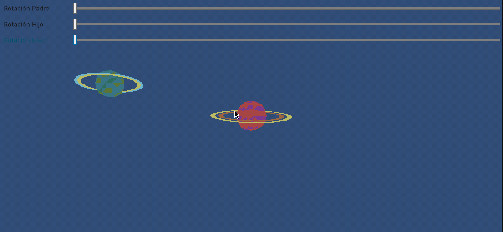
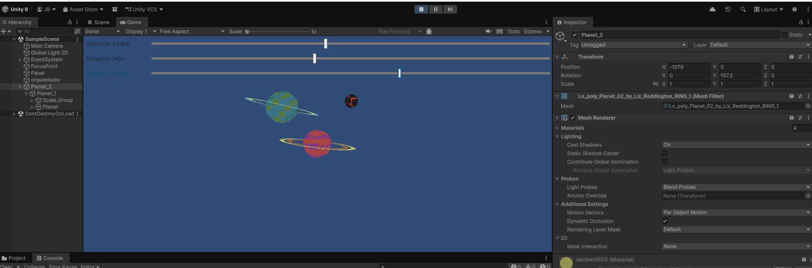

# Taller - Jerarquías y Transformaciones: El Árbol del Movimiento

## Juan Camilo Lopez Bustos
## 2026-02-21

---

## Descripción breve

El objetivo de este taller fue comprender y aplicar estructuras jerárquicas (árboles de transformación) para organizar escenas 3D. Se exploró cómo las transformaciones aplicadas a un nodo "padre" afectan de manera relativa a sus nodos "hijos" y "nietos". 

La actividad se centró en la creación de sistemas donde el movimiento es heredado, permitiendo simular comportamientos complejos (como un sistema solar o un brazo robótico) mediante la manipulación de un solo punto de origen.

---

## Implementaciones

### 1. Three.js con React Three Fiber
Se desarrolló una escena utilizando **Vite** y **React Three Fiber** para gestionar el grafo de escena. 
* **Jerarquía:** Se utilizó la etiqueta `<group>` para agrupar múltiples `<mesh>`.
* **Control:** Se integró la librería **Leva** para proporcionar sliders de control en tiempo real sobre la rotación y posición del nodo padre.
* **Estado de la visualización:** Se logró implementar la jerarquía funcional, aunque se presentó una dificultad estética: los objetos quedaron superpuestos en el origen. Sin embargo, se validó mediante los controles de Leva que la rotación aplicada al grupo afectaba a todos los elementos internos como una sola unidad.

### 2. Unity (LTS)
Se construyó una jerarquía física en el editor de Unity consistente en tres niveles: **Padre → Hijo → Nieto**.
* **Estructura:** Se utilizaron cubos y esferas anidados en la jerarquía del `Inspector`.
* **Scripting:** Un script en C# permitió vincular la interfaz de usuario (UI Sliders) con las propiedades del nodo raíz.
* **Herencia:** Se observó cómo al rotar o escalar el objeto padre, los descendientes mantenían su posición relativa pero sufrían las mismas transformaciones espaciales.

---

## Resultados visuales

### Three.js - Implementación y Controles

*Descripción: Interfaz de Leva controlando la rotación del grupo. Se observa la superposición de mallas pero la rotación jerárquica funcional.*

### Unity - Jerarquía en Movimiento

*Descripción: Manipulación del nodo padre mediante sliders y observación de la herencia de transformación en hijo y nieto.*


*Descripción: Vista del Inspector mostrando los valores de posición y rotación actualizándose en tiempo real.*

---

## Código relevante

### Fragmento de Jerarquía en React Three Fiber:
```jsx
/* ---------------- SISTEMA JERÁRQUICO ---------------- */
function HierarchySystem() {
  // Tamaños de los planetas
  const planet2Size = 1.5; // Centro
  const planet1Size = 1;   // Hijo
  const planetSize = 0.7;  // Nieto

  // Radios de separación (ajustados para evitar solapamiento)
  const orbitRadiusChild = 4;      // Órbita de Planet_1 respecto a Planet_2
  const orbitRadiusGrandchild = 2.5; // Órbita de Planet respecto a Planet_1

  // Controladores para el nodo padre (Planet_2)
  const { rotY, posX, posZ } = useControls("Padre (Planet_2)", {
    rotY: { value: 0, min: 0, max: Math.PI * 2, step: 0.01, label: "Rotación Y" },
    posX: { value: 0, min: -10, max: 10, step: 0.1, label: "Posición X" },
    posZ: { value: 0, min: -10, max: 10, step: 0.1, label: "Posición Z" },
  });

  // Controlador para el hijo (Planet_1)
  const { rotYChild } = useControls("Hijo (Planet_1)", {
    rotYChild: { value: 0, min: 0, max: Math.PI * 2, step: 0.01, label: "Rotación Y" },
  });

  // Controlador para el nieto (Planet)
  const { rotYGrandchild } = useControls("Nieto (Planet)", {
    rotYGrandchild: { value: 0, min: 0, max: Math.PI * 2, step: 0.01, label: "Rotación Y" },
  });

  return (
    // Nodo padre: Planet_2
    <group position={[posX, 0, posZ]} rotation={[0, rotY, 0]}>
      <Planet path="/models/Planet_2.glb" size={planet2Size} />
      {/* Órbita visual para Planet_1 */}
      <Orbit radius={orbitRadiusChild} />

      {/* Nodo hijo: Planet_1 */}
      <group rotation={[0, rotYChild, 0]}>
        <group position={[orbitRadiusChild, 0, 0]}>
          <Planet path="/models/Planet_1.glb" size={planet1Size} />
          {/* Órbita visual para Planet */}
          <Orbit radius={orbitRadiusGrandchild} />

          {/* Nodo nieto: Planet */}
          <group rotation={[0, rotYGrandchild, 0]}>
            <group position={[orbitRadiusGrandchild, 0, 0]}>
              <Planet path="/models/Planet.glb" size={planetSize} />
            </group>
          </group>
        </group>
      </group>
    </group>
  );
}
```
### Fragmento de Jerarquía en unity:
```csharp
// Métodos para rotar usando localRotation para respetar la jerarquía
    void RotatePadre(float value) 
    { 
        if(planet2Padre != null) planet2Padre.localRotation = Quaternion.Euler(0, value, 0); 
    }
    
    void RotateHijo(float value) 
    { 
        if(planet1Hijo != null) planet1Hijo.localRotation = Quaternion.Euler(0, value, 0); 
    }
    
    void RotateNieto(float value) 
    { 
        if(planetNieto != null) planetNieto.localRotation = Quaternion.Euler(0, value, 0); 
    }
}
```

---

## Prompts utilizados

- "Configurar una jerarquía de grupos en React Three Fiber con controles de Leva."

- "¿Cómo leer valores de un slider de UI en Unity para rotar un objeto padre?"

- "Explicación de por qué mis objetos en un grupo de Three.js aparecen en la misma posición (0,0,0)."


---

## Aprendizajes y dificultades


### Aprendizajes

- Transformaciones Relativas: Comprendí que la posición de un hijo siempre es relativa a su padre. Si el hijo está en (0,0,0) localmente, siempre estará donde esté el padre, sin importar la posición global de este último.

- Grafo de Escena: La importancia de organizar los objetos no solo por estética, sino por lógica de movimiento.

### Dificultades

- Superposición en Three.js: Mi mayor dificultad fue la ubicación espacial. Al crear la jerarquía, no definí desplazamientos (position) distintos para cada malla hija, lo que resultó en que todos los objetos se renderizaran uno sobre otro en el centro del grupo. Aunque la jerarquía funcionaba lógicamente (se movían juntos), la claridad visual se vio afectada.

- Sincronización de UI: En Unity, conectar los eventos del Slider con las funciones del script requirió entender el sistema de eventos de la UI.

### Mejoras futuras

Aprender mejor el uso de trheejs para poder visualizar de forma correcta los objetos.
---


## Referencias
- Three.js Journey (Bruno Simon). Three.js Groups.
- React Three Fiber Documentation. 
- Leva Documentation. Getting Started with Leva. 
- Unity Scripting Reference. Transform.Rotate. 
- Planet by Quaternius (https://poly.pizza/m/18Uxrb2dIc)
- Planet by Liz Reddington [CC-BY] (https://creativecommons.org/licenses/by/3.0/) via Poly Pizza (https://poly.pizza/m/736PuyxX-ON)
- Planet by Liz Reddington [CC-BY] (https://creativecommons.org/licenses/by/3.0/) via Poly Pizza (https://poly.pizza/m/fmu3junbyry)

---

## Checklist de entrega

- [ ] Carpeta con nombre `semana_XX_Y_nombre_taller`
- [ ] Código limpio y funcional en carpetas por entorno
- [ ] GIFs/imágenes incluidos con nombres descriptivos en carpeta `media/`
- [ ] README completo con todas las secciones requeridas
- [ ] Mínimo 2 capturas/GIFs por implementación
- [ ] Commits descriptivos en inglés
- [ ] Repositorio organizado y público

---
